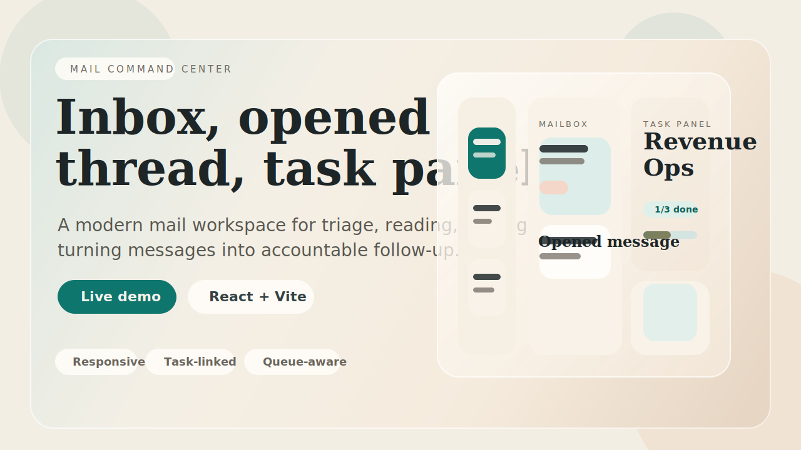
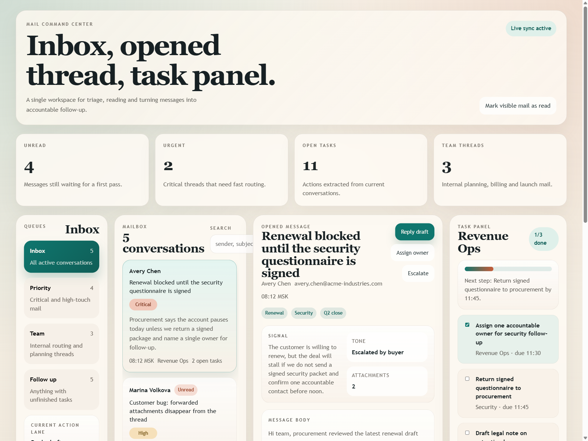

<div align="center">


<br/>
<br/>



<br/>
<br/>

<strong>Modern mail workspace for triage-heavy teams.</strong>

<br/>

Queues on the left, opened thread in the center, accountable follow-up on the right.

<br/>
<br/>

<a href="https://napannich.github.io/mail-command-center/">
  
</a>
<a href="https://github.com/napannich/mail-command-center">
  
</a>

<br/>
<br/>


</div>

<br/>

## Co-authors

- **[vl.litvintsev@yandex.ru](mailto:vl.litvintsev@yandex.ru)** — [@v-litvintsev](https://github.com/v-litvintsev)

<br/>

## Product Preview



<br/>

## What This Is

Mail Command Center is a clean, high-clarity email workspace designed for teams that do more than just read messages.

It turns the inbox into an operating surface:

- queue-aware mailbox for fast triage
- opened thread view for deep reading and context
- task panel that keeps owners, due times and next steps attached to the active conversation
- responsive layout that still feels composed on narrower screens

Instead of scattering work across tabs, notes and chat, the UI keeps the message, the signal and the follow-up in one place.

## Why The Repo Feels Like A Product

<table>
  <tr>
    <td width="33%" valign="top">
      <strong>Queue-first inbox</strong>
      <br/>
      Filter by priority, team traffic or follow-up state.
      Search stays fast and the mailbox always shows how much unresolved work is still in flight.
    </td>
    <td width="33%" valign="top">
      <strong>Opened thread as a workspace</strong>
      <br/>
      The central panel is not just a reading surface.
      It includes summary, sender identity, timeline context and attachment awareness in the same view.
    </td>
    <td width="33%" valign="top">
      <strong>Tasks attached to the conversation</strong>
      <br/>
      Every selected thread brings its own checklist, ownership lane and progress signal, so action lives next to the message that created it.
    </td>
  </tr>
</table>

## Experience Highlights

- Editorial typography and warm dashboard tones keep the interface product-like instead of template-like.
- The three-surface layout makes scanning, reading and acting feel immediate.
- Mail selection marks items as read and updates the detail and task panels in sync.
- Search filters by sender, subject, route, summary and tags.
- Queue counts, unread totals and task totals update from the same in-memory source of truth.
- The app is deployed automatically to GitHub Pages on push to `main`.

## Live Demo

- App: [napannich.github.io/mail-command-center](https://napannich.github.io/mail-command-center/)
- Repository: [github.com/napannich/mail-command-center](https://github.com/napannich/mail-command-center)

## Local Setup

```bash
git clone https://github.com/napannich/mail-command-center.git
cd mail-command-center
npm install
npm run dev
```

Open the local Vite URL from the terminal.

## Production Checks

```bash
npm run lint
npm run build
```

## Stack

| Layer | Implementation |
| --- | --- |
| Frontend | `React 19` + `TypeScript` |
| Build tooling | `Vite 8` |
| Styling | hand-authored `CSS` |
| State | local React state with `startTransition` and `useDeferredValue` |
| Deployment | `GitHub Pages` via GitHub Actions |

## Design Direction

- warm editorial palette instead of generic neon SaaS colors
- serif-driven heading system for a stronger product voice
- glassy panels and soft shadows for depth without visual clutter
- motion kept intentional and minimal rather than overloaded with micro-animations

## Project Structure

```text
mail-command-center/
|
|-- .github/
|   |-- assets/
|   |   |-- mail-command-center-hero.svg
|   |   `-- mail-command-center-preview.png
|   `-- workflows/
|       `-- deploy.yml
|
|-- public/
|   `-- favicon.svg
|
|-- src/
|   |-- App.tsx
|   |-- App.css
|   |-- index.css
|   `-- main.tsx
|
|-- index.html
|-- package.json
|-- tsconfig.json
`-- vite.config.ts
```

## Shipping Model

Pushes to `main` trigger the Pages workflow in [deploy.yml](./.github/workflows/deploy.yml), build the app and publish the static bundle to GitHub Pages.

That keeps the repository presentation, source code and live demo tied together in one clean loop.

<div align="center">

<br/>

<strong>Mail Command Center</strong>

<br/>

Built to read faster, route cleaner and look like a finished product on first open.

<br/>
<br/>

</div>
